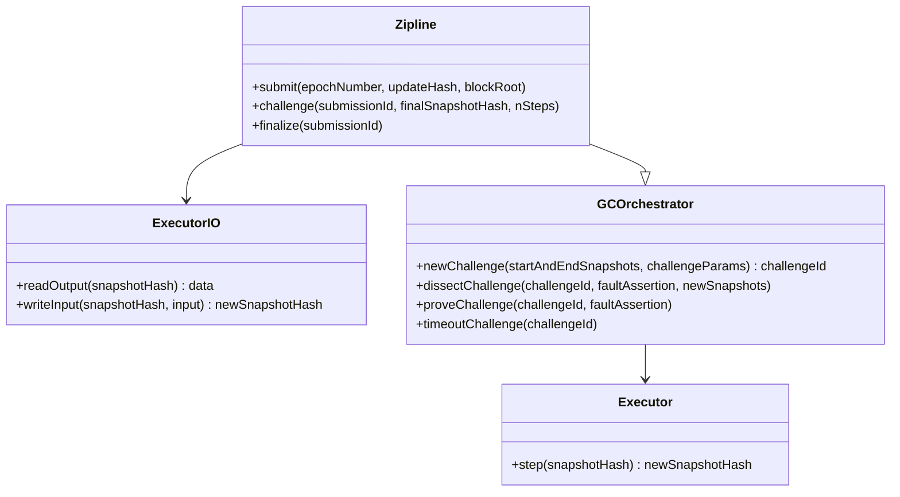

# Zipline Contracts

A collection of Solidity contracts that implement the on-chain component of the Zipline protocol

## Dependencies

- Install [Foundry](https://getfoundry.sh/) 

## Developer Quickstart

```shell
forge install
```

## Testing

```shell
forge test
```

## Architecture


The system can be cleanly split into 4 major components with well defined concerns. This allows for pluggable components (e.g. replacing the MIPS execution with another instruction set like RISCV) and reusing existing implementations.



## Executor

```solidity
interface IExecutor {
    function step(bytes32 snapshotHash) external returns (bytes32 nextSnapshotHash);
}
```

The executor is responsible for performing the one-step execution required for fraud proofs. It makes no assumptions about the underlying micro-architecture, only that it can take a commitment to an execution trace snapshot and deterministically transition this to a new snapshot commitment.

How the instructions, registers, memory, etc are read from the snapshot given its commitment is an implementation detail. In the MIPS implementation this requires posting Merkle tree nodes on-chain so they are available to construct proofs into the snapshot. If the data required to construct a proof is not available the `step` function will revert.

## ExecutorIO

```solidity
interface IExecutorIO {
    function readOutput(bytes32 snapshotHash) external view returns (bytes32 output);
    function writeInput(bytes32 snapshotHash, bytes32 input) external returns (bytes32 nextSnapshotHash);
}
```

Similar to the executor this contract provides functions to find the next snapshot hash after writing to designated locations in memory and also to read other designated locations. Similarly to the above this will likely require data being made available to support proofs into the snapshot. Reading the output should also check that the execution has signalled termination of the program.

## GCOrchestrator

```solidity
interface IGCOrchestrator {
    function newChallenge(
        bytes32[2] memory startAndEndSnapshots,
        uint256 nSteps,
        address defender,
        address challenger
    ) internal returns (uint64);

    function dissectChallenge(uint64 challengeId, FaultAssertion calldata assertion, bytes32[] calldata newSnapshots)
        public;

    function proveChallenge(uint64 challengeId, FaultAssertion calldata assertion)
        public;

    function timeoutChallenge(uint64 challengeId) public;
```

The challenge orchestrator abstracts any bridge related details and reduces a challenge down to an assertion of a start and end snapshot commitment with respect to an executor. This assertion is either true or false and once a challenge has been started it will eventually conclude by either completing the interactive game and executing a one-step proof, or by either party failing to move in time resulting in a timeout.

It holds the state of open challenges including the participants and which must move next, time since last update, and a hash that commits to the challenge state. Using a commitment to the challenge state reduces the storage requirements but requires the challenge game participants to resubmit the prior step challenge state each time.


Unlike the original Cannon challenge game the Zipline game supports splitting the trace into multiple sections (e.g. k-section) per round rather than just bisecting it in half (i.e. \\(k=2\\)). This is a very favorable trade-off as the number of round is proportional to \\(\log_k(N)\\), where \\(N\\) is the number of instructions in the trace. The demo currently runs with \\(k=15\\) but an optimal value should be selected for a production deployment once the average trace length is known.

## Zipline

```solidity
interface IZipline {
    function trustedCheckpoints(uint64 epoch) external (bytes32);
    function submit(uint64 epoch, bytes32 blockRoot) external;
    function challenge(
        uint64 epoch,
        bytes32 rivalBlockRoot,
        bytes calldata proofData,
        bytes32 finalSnapshot,
        uint256 nSteps
    ) external;
    function finalize(uint64 epoch) external;
}
```

This is the only component that is specific to the Zipline protocol. The rest can be used to perform fraud-proofs on any kind of execution.

It keeps track of the relayed submissions, the stake assigned to these submitting, which block roots are pending and finalized and any open challenges.

It is permissionless to submit new candidate blockRoots for consideration but these require stake above a certain threshold in order to finalize. Once staked upon the stake cannot be removed from a submission until it is either finalized or has been proven fraudulent (in which case the stake is returned to the challenger).

It is also permissionless to finalize a submission once the fraud proving window has elapsed.

The Zipline contract stores and makes available all finalized block roots for consumption by other protocols (e.g. token bridges) via the `trustedCheckpoints` map.
