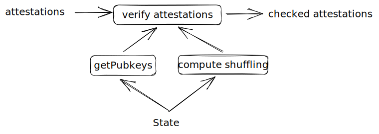
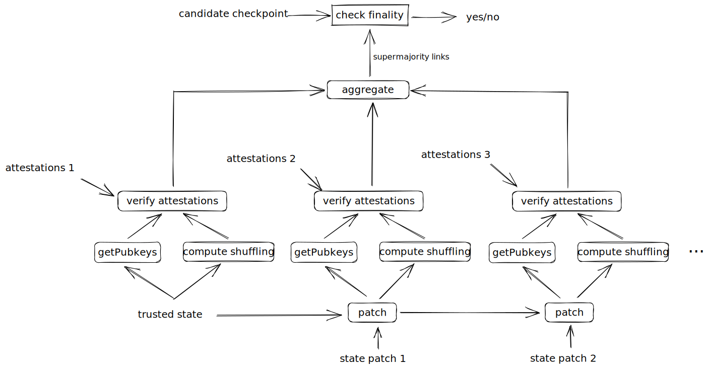

# Casper Stateless Finality Client

We define the idea of a finality client for the beacon chain. This differs from a light-client in that it follows the Casper finality protocol in full and inherits all of its security properties. It also differs from a full node in that it does not store the full beacon state, follow the chain tips or participate in p2p communication with other nodes.

It is recommended to first study the [Gasper paper](https://arxiv.org/pdf/2003.03052.pdf) which defines the variant of Casper used by the Ethereum beacon chain. In particular sections 4.1-4.5. Notation from this paper will be used in this section.

## Objectives

- It should only be required to store the absolute minimum data and this should be constant size
- It should only need to receive an update once per epoch
- This update should be as small as possible
- The protocol should inherit the same security as a full node

## Preliminaries

A checkpoint in Casper is a 2-tuple consisting of a block hash and an epoch number. A beacon chain block contains a state root. A beacon state contains all of the validator keys and other data required to calculate a shuffling which determines which validators should attest in each slot. 

Validators attest to source-target pairs called links where the source and target are checkpoints. They attest by signing the link plus some additional data (slot number, committee number) with their BLS private key. If a link has received attestation by $(2/3)$ of the validator set it is said to be a supermajority link. A checkpoint is said to be justified if it is the target of a supermajority link with a justified source. A checkpoint is said to be finalized if all of the following hold:

- it is justified
- it is the source of a supermajority link with a justified target
- and where all adjacent intermediate checkpoints are also justified.

## Design

The design was arrived at by starting with the regular Gasper protocol and removing/compressing parts until the objectives were met.

An iteration starts with an initial trusted checkpoint, $C_t$ which is known to be finalized. Given some candidate checkpoint, $C$, and some additional proof data, the aim of the protocol is to determine if the conditions have been met for $C$ to be finalized. Doing so will require obtaining and verifying enough attestations to form supermajority links which justify $C$ and at least the next direct successor $C'$, as well as the supermajority link to finalize $C$.

Verifying attestations requires two things - the public keys of all activate validators, and the shuffling which assigns each validator to a slot/committee. All data required to verify the attestations for an epoch is contained within the beacon state as of the first block of the epoch. Attestations from multiple epochs will need to be aggregated in order to finalize the candidate checkpoint. This will require computing the shufflings and aggregating keys from multiple beacon states.

A full client stores the beacon state locally and derives future states by applying every block received during and epoch. Since the finality client is stateless it will need to receive relevant pieces of the state each iteration.

### Inputs

Inputs to the verifier can be split into two types - trusted inputs and free inputs.

#### Trusted

Trusted inputs are those which are committed to by the trusted checkpoint (which we can assume is part of a finalized chain). This includes:

- Beacon state as of the trusted checkpoint. This itself commits to:
    - validator keys, activation status, balances, slash status, etc
    - RANDAO reveals

The trusted values can be used as though they are already known to be part of the finalized chain. The state in particular is useful as it allows access to the full set of validators which can be used to verify attestations in the following epoch.

#### Free

There are also the free inputs. These include:

- The candidate checkpoint
- Attestations
- State patches

Free inputs can be manipulated by an attacker attempting to convince the verifier that the checkpoint has finalized when it has not. In the [section on attacks](./attacks.md) we argue that an attacker can at best degrade the security threshold by some amount $D$ which is very small compared with the size of the validator set.

#### State Patches

Recall that the protocol must also be able to compute validator shuffling for subsequent epochs not just the one following the trusted checkpoint. The pieces of state data that changes between epochs which impacts the validator shuffling are:

- epoch number
- validator activations
- validator exits
- number of new validators
- RANDAO reveal

A data structure that captures the changes in these fields between two adjacent epochs we term a [state patch](./containers.md/#state-patch). These are part of the free inputs to the verify function.

### Operation

The basic premise of the finality client is that it starts from a trusted checkpoint and projects ahead a number of epochs in order to verify the signatures on all provided attestations, construct supermajority links, and finalize the given candidate.

A single step of the operation involves retrieving the requisite data from the state in order to compute the validator shuffling and verify the attestations that originate from a single epoch.

However a single epochs worth of attestations is not enough to produce the supermajority links needed to finalize a checkpoint. In the best case where the chain is finalizing as fast as possible this requires at least 2 epochs worth and that number may be much more.

The finality client uses state patches to advance the trusted state to future epochs which can then be used to verify attestations originating in those epochs. Note that this patched state will not be identical to the state obtained by a full client following the chain but it will be able to verify valid attestations. 

The combined attestations from all epochs are aggregated and the supermajority links created. These supermajority links can then be used to prove the finality of the candidate checkpoint.

