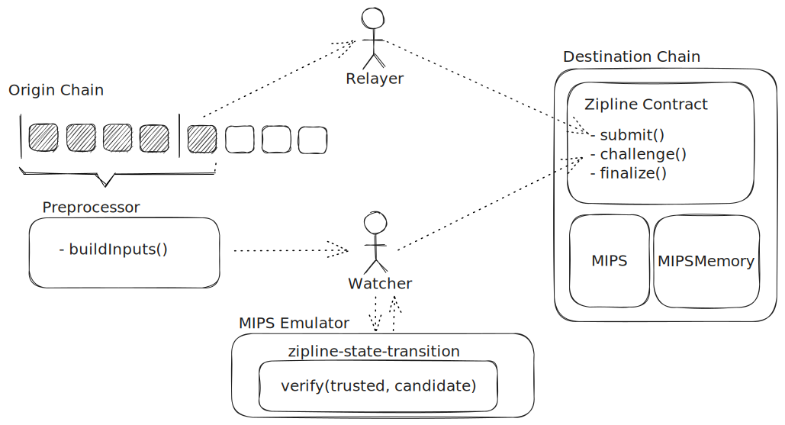

# Introduction

Zipline is a permissionless block header oracle from Gasper chains (e.g. Ethereum/Gnosis beacon chains) to EVM chains. It uses fault proofs to ensure that any relayed block roots that have not been finalized by the origin chain will be rejected.

## Setup and Goals

Our goal in creating Zipline was to define a protocol that can produce a regularly updated, trusted, source of finalized blocks for the origin chain within the execution of the destination chain.

The sub-goals for this are:

1. To do so as cheaply as possible with respect to destination chain storage and execution
2. Keep the protocol participation permissionless with no specialized roles
3. To minimize the time between blocks finalizing on the origin chain and being accepted as trusted on the destination
4. To avoid the use of any additional cryptography (e.g. ZKPs) not used by the underlying protocol

## Construction

The design of Zipline closely follows that of [Optimism Cannon](https://github.com/ethereum-optimism/cannon) and shares several components. It is comprised of:

- An off-chain emulator and on-chain contract capable of executing [MIPS micro-architecture](https://en.wikipedia.org/wiki/MIPS_architecture) instructions
- A verifier program which can run in these environments and verify Casper chain finality
- A contract that manages pending block headers and open challenges
- A pre-processor that reads from a Gasper chain and produces inputs to the verifier

It also relies on two types of actors - relayers and watchers. 

Relayers are responsible for watching the origin chain and submitting finalized epoch boundary blocks (EBBs) to the Zipline contract on the destination where they enter pending status.

Watchers are responsible for watching both the origin chain and the destination chain and detecting when an EBB submitted to the Zipline contract does not match the EBB finalized by the origin chain for the given epoch. If they observe this they must construct an input payload for the verify function, run the verify function in their emulator to obtain the final state of the trace, and submit both of these to the Zipline contract via the `challenge` method which will start a challenge game between themselves and the fraudulent relayer.

Both of these roles are permissionless and the protocol guarantees that an honest watcher will always win against an dishonest relayer and visa-versa.

