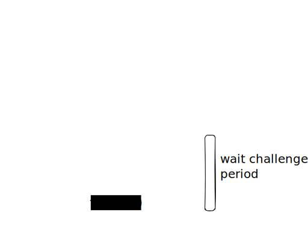

# Protocol Overview

The Zipline protocol produces a trusted source of finalized checkpoints (block root + epoch) for the origin chain within the execution of the destination chain. Checkpoints can be trusted under the assumption that any incorrect checkpoints can be proven incorrect and that observers are incentivised to do so in a timely manor.

Checkpoints are proven incorrect by proving the correctness of another finalized checkpoint at the same height using the [finality client](./4_finality_client.md) since by design the Casper algorithm will only allow a single chain of checkpoints to finalize. The finality client is too expensive to execute on-chain so instead the result of its execution is proven using fault proofs.

The protocol operates under two phases which we call the *happy case* and the *challenge case*. 

## Happy Case

In the happy case the protocol is exceedingly simple and requires almost no execution or calldata and minimal storage on the destination chain. This makes it very cheap during regular operation which, provided the correct incentives are in place, should be all of the time. The protocol progresses as follows:

1. A bonded relayer posts a finalized checkpoint (the candidate) to the zipline contract on the destination chain by submitting a transaction
2. This is stored along with the address of the relayer and the timestamp it was received

After a sufficiently long time has elapsed without challenge the relayer may unbond and the checkpoint is considered trusted. Consumers of the oracle can elect to trust the checkpoint sooner depending on their security threshold.

See [analysis chapter]() for the storage and gas usage for the happy case on an EVM destination.

## Challenge Case

As previously mentioned the challenger does not prove the invalidity of the most recent update but rather the validity of an alternative finalized checkpoint at the same height.

A challenge is made by another bonded relayer submitting the following in a transaction on the destination:
- The ID of the update they are challenging
- [A SSZ serialized ZiplineInput container](containers.md#zipline-input)
- The terminal memory snapshot and CPU cycle count obtained by executing the verify program with the given ZiplineInput. Note this final snapshot must indicate a successful termination and acceptance of the candidate checkpoint

This initiates a challenge between the original checkpoint relayer (now defender) and the challenger. The challenger must first respond with their own different terminal snapshot and CPU count indicating either an unsuccessful termination or invalid candidate. After this the challenge game plays out as in interactive bisection game over the execution trace to determine which player (or both) submitted an incorrect trace.

If the game terminates in favour of the defender then the challengers bond is reassigned to the defender and the submission is allowed to remain. If it terminates in favour of the challenger then the defenders bond is reassigned to the challenger and the submission is removed.

The below sequence diagram illustrates a fraudulent relayer being successfully challenged and their invalid checkpoint being rolled back.

